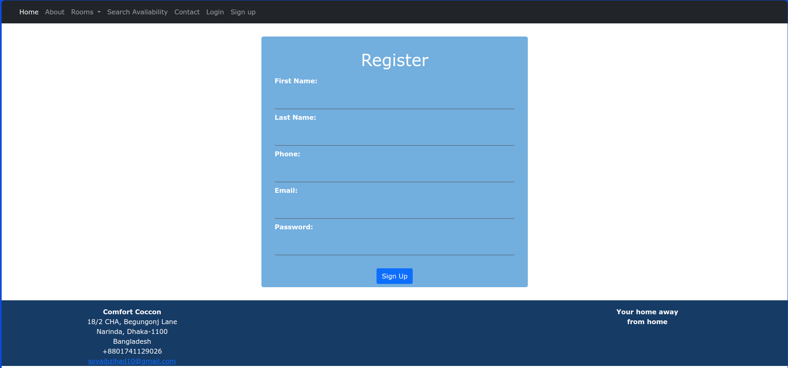
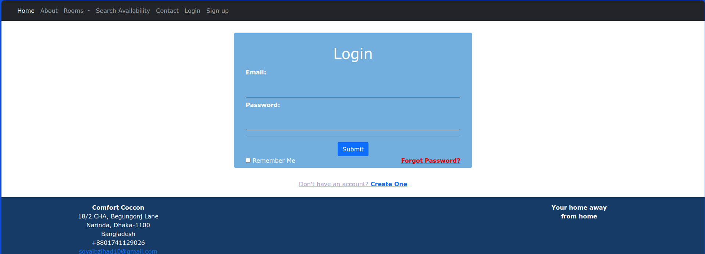
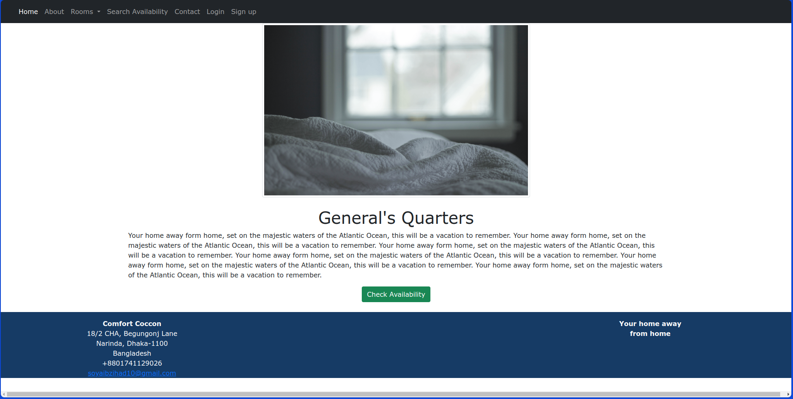
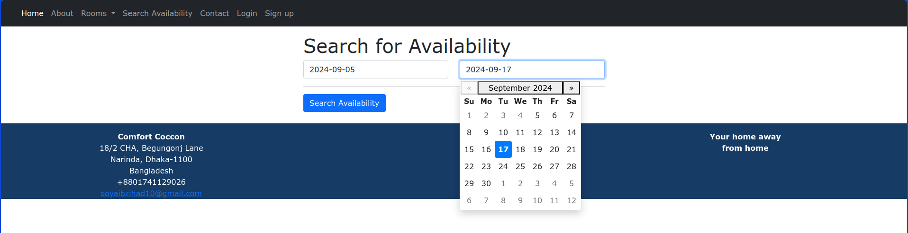
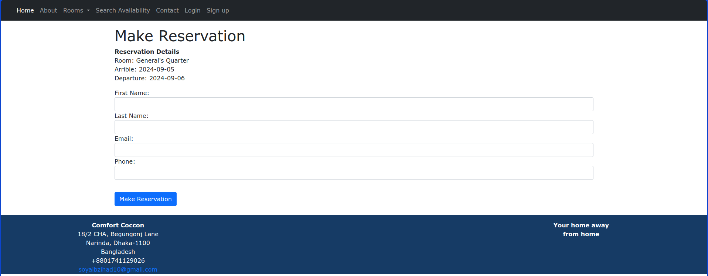
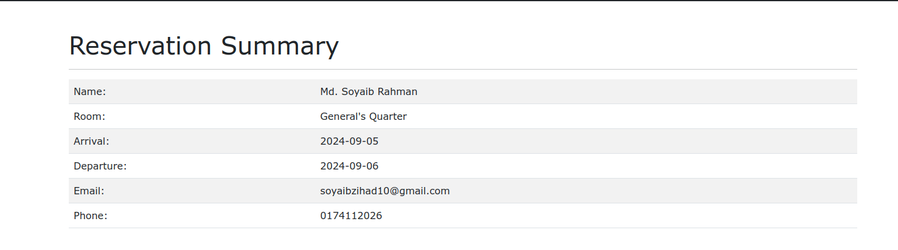
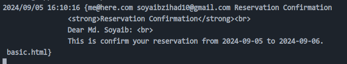
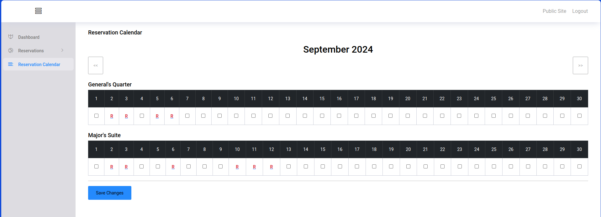
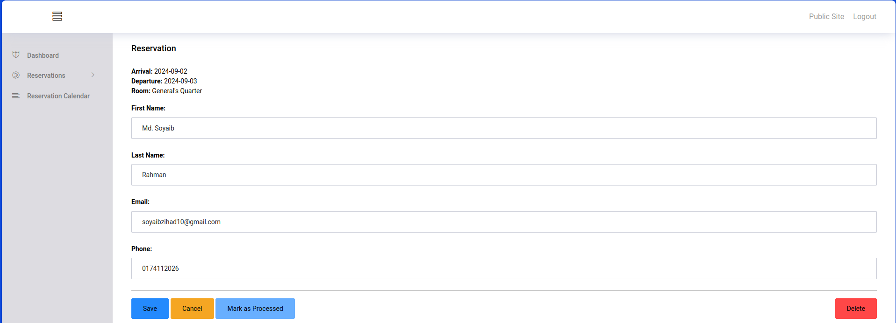

# **Comfort Cocoon** - Hotel Room Booking System

This project is a hotel room booking system designed to provide an easy interface for both visitors and admins to manage room bookings efficiently.

---

## **Key Features**

### For Visitors:
- **Create Account/Login**: Users can create an account or log in to access the system.
- **Search Option**: Search for available rooms by date and preferences.
- **Book Rooms**: Easily book available rooms from the options shown.
- **Calendar Integration**: View booking dates with calendar integration.
- **Get Confirmation**: Get instant confirmation of the room reservation.

### For Admin:
- **Manage Bookings**: Admins can view and manage all bookings.
- **Accept or Reject Bookings**: Admins can approve or decline room booking requests.

---

## **Tech Stack**

### Frontend:
- HTML, CSS, Bootstrap, JavaScript

### Backend:
- Go (Golang)

### Database:
- MySQL

### Packages:
- Chi Router
- SCS Session Manager
- Justin NoSurf Package for CSRF Protection


---

## **Limitations**
- No transaction/payment integration yet.

---

## **Demonstration**

This project demonstrates a fully functional hotel management system with distinct functionalities for users and admins.

### Screenshots

#### 1. Homepage

The homepage gives an overview of available rooms and other hotel services.

#### 2. Registration Page

Visitors can create accounts by filling in the registration form.

#### 3. Login Page

Users can log in to manage their bookings and account details.

#### 4. Rooms Available

Visitors can browse through available rooms to make reservations.

#### 5. Search Availability

Search for room availability on specific dates.

#### 6. Room Reservation

The room reservation page allows users to choose their desired room and confirm the booking.

#### 7. Reservation Summary

The reservation summary page shows the user’s booking details before confirming.

#### 8. Confirmation Page

This page confirms that the room has been successfully reserved.

#### 9. Admin Dashboard

The admin dashboard for managing users, rooms, and bookings.

#### 10. Admin Manages Bookings

Admins can manage bookings, approve or reject them, and view system resources.   


**Download Instructions**
Download Source Code "<b>Comfort Cocoon</b>"

- <b>Its all about for linux</b>
- FIRST Download the source code
- Extract the file and copy "Comfort Cocoon" folder
- Open this Comfort Cocoon folder in your fovourite Editor (Like: <b>Virtual studio code</b>)
- Install XAMPP and go to your command prompt and run

```
sudo /opt/lampp/lampp start
```

- Then Open PHPMyAdmin (http://localhost/phpmyadmin)

- Then create a Database <b>bookings</b>
- Import bookings.sql.zip file(given inside the Database folder in your download folder) in this "bookings" Database
- Open the terminal and go to your project name directory and run

```
go mod tidy
```

```
./run.sh
```

- Go to your browser and go http://localhost/8080/

**LOGIN DETAILS**

Create your own staff

For Admin

- Email: admin@admin.com
- Password: password